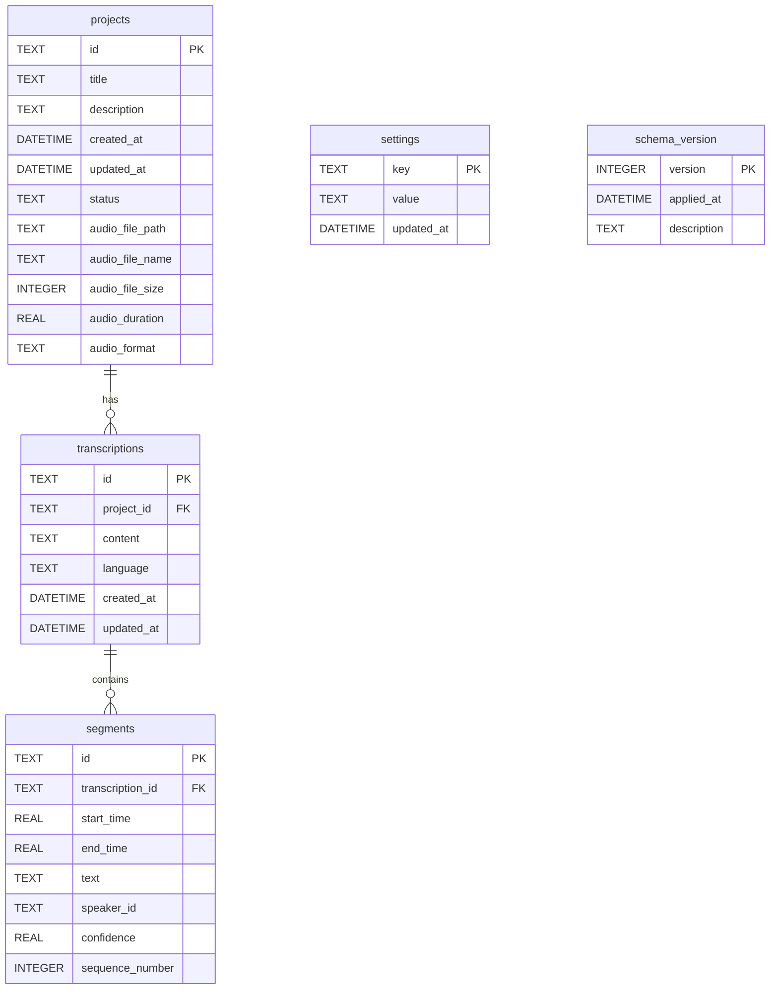
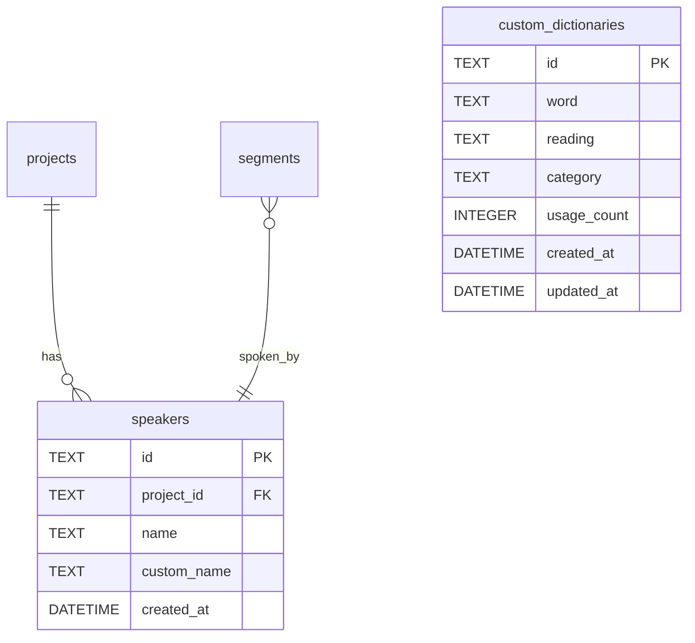

# データモデル設計書 (Entity-Relationship Design)

## 概要

このドキュメントでは、Transcription Appのデータベーススキーマについて詳細に説明します。

**データベース**: SQLite
**ORM/クエリビルダー**: better-sqlite3 (ネイティブSQLクエリ)
**マイグレーション管理**: カスタムマイグレーションシステム (詳細は [database-migrations.md](./database-migrations.md))

---

## ER図



**Phase 2での拡張予定**:


---

## テーブル詳細

### 1. `schema_version`

マイグレーションバージョン管理テーブル

| カラム名 | 型 | 制約 | 説明 |
|---------|---|------|------|
| version | INTEGER | PRIMARY KEY | スキーマバージョン番号 |
| applied_at | DATETIME | DEFAULT CURRENT_TIMESTAMP | マイグレーション適用日時 |
| description | TEXT | NOT NULL | マイグレーションの説明 |

**用途**:
- データベースマイグレーションの追跡
- アプリケーション起動時の未適用マイグレーション検出

**データ例**:
```sql
version | applied_at          | description
--------|---------------------|---------------------------
1       | 2026-01-03 14:00:00 | Initial schema - Phase 1 MVP
```

---

### 2. `projects`

音声文字起こしプロジェクト管理テーブル

| カラム名 | 型 | 制約 | 説明 |
|---------|---|------|------|
| id | TEXT | PRIMARY KEY | プロジェクトID (UUID v4) |
| title | TEXT | NOT NULL | プロジェクト名 |
| description | TEXT | NULL | プロジェクトの説明 |
| created_at | DATETIME | DEFAULT CURRENT_TIMESTAMP | 作成日時 |
| updated_at | DATETIME | DEFAULT CURRENT_TIMESTAMP | 更新日時 |
| status | TEXT | DEFAULT 'pending', CHECK | ステータス (pending, processing, completed, failed) |
| audio_file_path | TEXT | NOT NULL | 音声ファイルのパス |
| audio_file_name | TEXT | NOT NULL | 音声ファイル名 |
| audio_file_size | INTEGER | NULL | 音声ファイルサイズ (bytes) |
| audio_duration | REAL | NULL | 音声の長さ (秒) |
| audio_format | TEXT | NULL | 音声フォーマット (mp3, wav, m4a等) |

**インデックス**:
- `idx_projects_status ON (status)`: ステータスフィルタリング高速化
- `idx_projects_created_at ON (created_at DESC)`: 作成日時ソート高速化

**制約**:
- `CHECK (status IN ('pending', 'processing', 'completed', 'failed'))`: ステータスの妥当性検証

**リレーション**:
- `transcriptions` テーブルと1対多の関係 (1つのプロジェクトに複数の文字起こし)

**ステータス遷移**:
```
pending → processing → completed
                    ↘ failed
```

**データ例**:
```sql
id: '550e8400-e29b-41d4-a716-446655440000'
title: '2026年1月定例会議'
description: '月次定例会議の議事録作成'
created_at: 2026-01-03 10:00:00
updated_at: 2026-01-03 10:30:00
status: 'completed'
audio_file_path: '/Users/user/Documents/meeting.mp3'
audio_file_name: 'meeting.mp3'
audio_file_size: 15728640
audio_duration: 3600.5
audio_format: 'mp3'
```

---

### 3. `transcriptions`

文字起こし結果テーブル

| カラム名 | 型 | 制約 | 説明 |
|---------|---|------|------|
| id | TEXT | PRIMARY KEY | 文字起こしID (UUID v4) |
| project_id | TEXT | NOT NULL, FOREIGN KEY | プロジェクトID |
| content | TEXT | NOT NULL | 文字起こし全文 |
| language | TEXT | DEFAULT 'ja' | 言語コード (ISO 639-1) |
| created_at | DATETIME | DEFAULT CURRENT_TIMESTAMP | 作成日時 |
| updated_at | DATETIME | DEFAULT CURRENT_TIMESTAMP | 更新日時 |

**インデックス**:
- `idx_transcriptions_project_id ON (project_id)`: プロジェクトIDでの検索高速化

**外部キー制約**:
- `project_id` → `projects(id)` ON DELETE CASCADE
  - プロジェクト削除時に関連する文字起こしも自動削除

**リレーション**:
- `projects` テーブルと多対1の関係
- `segments` テーブルと1対多の関係

**データ例**:
```sql
id: '660e8400-e29b-41d4-a716-446655440001'
project_id: '550e8400-e29b-41d4-a716-446655440000'
content: 'おはようございます。本日の会議を始めます...'
language: 'ja'
created_at: 2026-01-03 10:15:00
updated_at: 2026-01-03 10:25:00
```

---

### 4. `segments`

タイムスタンプ付きテキストセグメントテーブル

| カラム名 | 型 | 制約 | 説明 |
|---------|---|------|------|
| id | TEXT | PRIMARY KEY | セグメントID (UUID v4) |
| transcription_id | TEXT | NOT NULL, FOREIGN KEY | 文字起こしID |
| start_time | REAL | NOT NULL | 開始時刻 (秒) |
| end_time | REAL | NOT NULL | 終了時刻 (秒) |
| text | TEXT | NOT NULL | セグメントテキスト |
| speaker_id | TEXT | NULL | 話者ID (Phase 2で使用) |
| confidence | REAL | NULL | 信頼度スコア (0.0-1.0) |
| sequence_number | INTEGER | NOT NULL | セグメント順序番号 |

**インデックス**:
- `idx_segments_transcription_id ON (transcription_id)`: 文字起こしIDでの検索高速化
- `idx_segments_sequence ON (transcription_id, sequence_number)`: 順序付き取得の高速化

**外部キー制約**:
- `transcription_id` → `transcriptions(id)` ON DELETE CASCADE
  - 文字起こし削除時に関連するセグメントも自動削除

**リレーション**:
- `transcriptions` テーブルと多対1の関係
- Phase 2: `speakers` テーブルと多対1の関係 (optional)

**データ例**:
```sql
id: '770e8400-e29b-41d4-a716-446655440002'
transcription_id: '660e8400-e29b-41d4-a716-446655440001'
start_time: 0.0
end_time: 5.2
text: 'おはようございます。'
speaker_id: NULL
confidence: 0.95
sequence_number: 1
```

---

### 5. `settings`

アプリケーション設定テーブル

| カラム名 | 型 | 制約 | 説明 |
|---------|---|------|------|
| key | TEXT | PRIMARY KEY | 設定キー |
| value | TEXT | NOT NULL | 設定値 (暗号化されている場合あり) |
| updated_at | DATETIME | DEFAULT CURRENT_TIMESTAMP | 更新日時 |

**用途**:
- APIキーの暗号化保存 (ElectronのsafeStorage APIで暗号化)
- アプリケーション設定の永続化

**設定キー例**:
- `OPENAI_API_KEY`: OpenAI API Key (暗号化)
- `ANTHROPIC_API_KEY`: Anthropic API Key (暗号化、Phase 3で使用)
- `last_export_directory`: 最後にエクスポートしたディレクトリパス

**データ例**:
```sql
key: 'OPENAI_API_KEY'
value: 'AQIDBAUGBwgJCgsMDQ4PEBESExQVFhcYGRobHB0eHyA='  -- Base64エンコードされた暗号化データ
updated_at: 2026-01-03 09:00:00
```

---

## Phase 2での拡張

### 6. `speakers` (Phase 2)

話者情報テーブル

| カラム名 | 型 | 制約 | 説明 |
|---------|---|------|------|
| id | TEXT | PRIMARY KEY | 話者ID (UUID v4) |
| project_id | TEXT | NOT NULL, FOREIGN KEY | プロジェクトID |
| name | TEXT | NOT NULL | 自動生成された話者名 (例: Speaker 1) |
| custom_name | TEXT | NULL | ユーザーが編集可能な話者名 |
| created_at | DATETIME | DEFAULT CURRENT_TIMESTAMP | 作成日時 |

**外部キー制約**:
- `project_id` → `projects(id)` ON DELETE CASCADE

**インデックス**:
- `idx_speakers_project_id ON (project_id)`

---

### 7. `custom_dictionaries` (Phase 2)

カスタム辞書テーブル

| カラム名 | 型 | 制約 | 説明 |
|---------|---|------|------|
| id | TEXT | PRIMARY KEY | エントリID (UUID v4) |
| word | TEXT | NOT NULL, UNIQUE | 単語 |
| reading | TEXT | NULL | 読み仮名 |
| category | TEXT | NULL | カテゴリ (専門用語、固有名詞等) |
| usage_count | INTEGER | DEFAULT 0 | 使用回数 |
| created_at | DATETIME | DEFAULT CURRENT_TIMESTAMP | 作成日時 |
| updated_at | DATETIME | DEFAULT CURRENT_TIMESTAMP | 更新日時 |

**インデックス**:
- `idx_dictionaries_word ON (word)`: 単語検索の高速化

---

## データ整合性

### 外部キー制約

SQLiteの外部キー制約は、アプリケーション起動時に以下で有効化されます：

```typescript
// electron/services/database/database-service.ts
this.db.pragma('foreign_keys = ON')
```

**カスケード削除の動作**:
1. `projects`テーブルのレコード削除
   → 関連する`transcriptions`レコードを自動削除
   → 関連する`segments`レコードも自動削除（cascadeチェーン）

### CHECK制約

- `projects.status`: 有効なステータス値のみ許可
  ```sql
  CHECK(status IN ('pending', 'processing', 'completed', 'failed'))
  ```

---

## クエリ例

### プロジェクト一覧取得（最近順）

```sql
SELECT * FROM projects
ORDER BY created_at DESC
LIMIT 20;
```

### プロジェクトと文字起こしを結合

```sql
SELECT
  p.*,
  t.id AS transcription_id,
  t.content,
  t.language
FROM projects p
LEFT JOIN transcriptions t ON p.id = t.project_id
WHERE p.id = ?;
```

### セグメントを順序付きで取得

```sql
SELECT * FROM segments
WHERE transcription_id = ?
ORDER BY sequence_number ASC;
```

### ステータス別プロジェクト数

```sql
SELECT status, COUNT(*) as count
FROM projects
GROUP BY status;
```

---

## パフォーマンス考慮事項

### インデックス戦略

1. **頻繁にフィルタリングされるカラム**: `status`, `created_at`
2. **外部キー**: すべての外部キーにインデックス付与
3. **複合インデックス**: `(transcription_id, sequence_number)` で順序付き取得を高速化

### 大規模データ対策

- **セグメント数**: 4時間の音声 → 約2,000-3,000セグメント
- **インデックス効果**: sequence_number順での取得を O(n log n) → O(n) に改善

---

## 参考資料

- [database-migrations.md](./database-migrations.md): マイグレーション戦略
- [api.md](./api.md): データベースアクセスAPI仕様
- [SQLite Documentation](https://www.sqlite.org/docs.html)
- [better-sqlite3 API](https://github.com/WiseLibs/better-sqlite3/blob/master/docs/api.md)

---

**最終更新**: 2026-01-03
**バージョン**: 1.0 (Phase 1)
