# データモデル ER図

## 概要

Transcription Appのデータベース設計を示すEntity-Relationship図です。

## ER図

```mermaid
erDiagram
    projects ||--o| transcriptions : "has"
    transcriptions ||--o{ segments : "contains"
    projects ||--o{ speakers : "has"
    transcriptions ||--o{ summaries : "generates"
    summaries ||--o{ summaries : "derives_from"
    projects }o--o{ dictionary_sets : "uses"
    dictionary_sets ||--o{ dictionary_entries : "contains"
    project_dictionary_sets }o--|| projects : "references"
    project_dictionary_sets }o--|| dictionary_sets : "references"

    projects {
        TEXT id PK "UUID"
        TEXT title "プロジェクト名"
        TEXT description "説明"
        DATETIME created_at "作成日時"
        DATETIME updated_at "更新日時"
        TEXT status "pending|processing|completed|failed"
        TEXT audio_file_path "音声ファイルパス"
        TEXT audio_file_name "ファイル名"
        INTEGER audio_file_size "ファイルサイズ(bytes)"
        REAL audio_duration "音声長さ(秒)"
        TEXT audio_format "mp3|wav|m4a等"
    }

    transcriptions {
        TEXT id PK "UUID"
        TEXT project_id FK "プロジェクトID"
        TEXT content "文字起こし全文"
        TEXT language "言語コード(ja等)"
        DATETIME created_at "作成日時"
        DATETIME updated_at "更新日時"
    }

    segments {
        TEXT id PK "UUID"
        TEXT transcription_id FK "文字起こしID"
        REAL start_time "開始時間(秒)"
        REAL end_time "終了時間(秒)"
        TEXT text "セグメント内容"
        TEXT speaker_id FK "話者ID(Phase2)"
        REAL confidence "信頼度スコア"
        INTEGER sequence_number "セグメント順序"
    }

    speakers {
        TEXT id PK "UUID"
        TEXT project_id FK "プロジェクトID"
        TEXT name "話者名(Speaker1等)"
        TEXT custom_name "カスタム名(ユーザー編集可)"
        DATETIME created_at "作成日時"
    }

    dictionary_sets {
        TEXT id PK "UUID"
        TEXT name UK "辞書セット名"
        TEXT description "説明"
        TEXT category "医療|法律|IT|ビジネス等"
        INTEGER entry_count "登録単語数"
        BOOLEAN is_active "有効/無効"
        DATETIME created_at "作成日時"
        DATETIME updated_at "更新日時"
    }

    dictionary_entries {
        TEXT id PK "UUID"
        TEXT dictionary_set_id FK "辞書セットID"
        TEXT word "単語"
        TEXT reading "読み仮名"
        TEXT word_type "名詞|動詞|固有名詞等"
        INTEGER usage_count "使用回数"
        DATETIME created_at "作成日時"
        DATETIME updated_at "更新日時"
    }

    project_dictionary_sets {
        TEXT id PK "UUID"
        TEXT project_id FK "プロジェクトID"
        TEXT dictionary_set_id FK "辞書セットID"
        INTEGER priority "優先度(数値が小さいほど優先)"
        DATETIME added_at "追加日時"
    }

    summaries {
        TEXT id PK "UUID"
        TEXT transcription_id FK "文字起こしID"
        TEXT summary_type "minutes|event_summary|brief|action_items等"
        TEXT content "要約内容"
        TEXT model "使用AIモデル(claude-3-opus等)"
        INTEGER version "バージョン番号"
        TEXT parent_summary_id FK "元の要約ID(再生成時)"
        BOOLEAN is_active "アクティブな要約"
        TEXT generation_params "生成パラメータ(JSON)"
        DATETIME created_at "作成日時"
        DATETIME updated_at "更新日時"
    }

    settings {
        TEXT key PK "設定キー"
        TEXT value "設定値"
        DATETIME updated_at "更新日時"
    }
```



## テーブル詳細

### 1. projects (プロジェクト)

**目的**: 音声ファイルと文字起こしプロジェクトの管理

**主要フィールド**:
- `id`: プロジェクトの一意識別子
- `status`: 処理状態を管理
  - `pending`: 未処理
  - `processing`: 処理中
  - `completed`: 完了
  - `failed`: 失敗
- `audio_*`: 音声ファイルのメタデータ

**リレーション**:
- 1つのプロジェクトは1つの文字起こし結果を持つ (1:1)
- 1つのプロジェクトは複数の話者を持つ (1:N) ※Phase 2

---

### 2. transcriptions (文字起こし)

**目的**: 文字起こし結果の全文保存

**主要フィールド**:
- `id`: 文字起こしの一意識別子
- `project_id`: 親プロジェクトへの参照
- `content`: 文字起こし全文（検索用）
- `language`: 言語コード（デフォルト: ja）

**リレーション**:
- 1つの文字起こしは複数のセグメントを持つ (1:N)
- 1つの文字起こしは複数の要約を持つ (1:N) ※Phase 3

**CASCADE DELETE**: プロジェクト削除時に自動削除

---

### 3. segments (セグメント)

**目的**: タイムスタンプ付き文字起こしの細分化

**主要フィールド**:
- `id`: セグメントの一意識別子
- `transcription_id`: 親文字起こしへの参照
- `start_time`, `end_time`: タイムスタンプ（秒単位）
- `text`: セグメント内容
- `speaker_id`: 話者識別（Phase 2で使用）
- `confidence`: Whisper APIの信頼度スコア
- `sequence_number`: 表示順序

**インデックス**:
- `transcription_id`: 高速検索用
- `sequence_number`: ソート用

**CASCADE DELETE**: 文字起こし削除時に自動削除

---

### 4. speakers (話者) ※Phase 2

**目的**: 話者情報の管理

**主要フィールド**:
- `id`: 話者の一意識別子
- `project_id`: プロジェクトへの参照
- `name`: 自動生成された話者名（Speaker 1, Speaker 2等）
- `custom_name`: ユーザーが編集可能な名前

**リレーション**:
- セグメントから参照される（1:N）

**CASCADE DELETE**: プロジェクト削除時に自動削除

---

### 5. dictionary_sets (辞書セット) ※Phase 2

**目的**: 分野・テーマ別の辞書グループ管理

**主要フィールド**:
- `id`: 辞書セットの一意識別子
- `name`: 辞書セット名（例: 医療用語、法律用語、IT用語）UNIQUE制約
- `description`: 辞書セットの説明
- `category`: カテゴリ分類（医療|法律|IT|ビジネス等）
- `entry_count`: 登録単語数（キャッシュ用）
- `is_active`: 辞書セットの有効/無効

**ユースケース例**:
- 「医療用語辞書」: MRI、CT、カルテなど
- 「法律用語辞書」: 訴訟、判例、原告など
- 「IT用語辞書」: API、デプロイ、リファクタリングなど
- 「企業名辞書」: 固有の企業名・製品名

**リレーション**:
- 複数の辞書エントリを持つ (1:N)
- 複数のプロジェクトから使用される (N:M)

---

### 6. dictionary_entries (辞書エントリ) ※Phase 2

**目的**: 各辞書セットに含まれる単語の管理

**主要フィールド**:
- `id`: エントリの一意識別子
- `dictionary_set_id`: 所属する辞書セット
- `word`: 単語
- `reading`: 読み仮名（オプション）
- `word_type`: 品詞・単語タイプ（名詞、動詞、固有名詞等）
- `usage_count`: 使用頻度追跡

**特徴**:
- 同じ単語が複数の辞書セットに存在可能
  - 例: 「アップル」→ IT辞書（Apple社）、食品辞書（りんご）
- 辞書セット単位で有効/無効を切り替え可能

**インデックス**:
- `dictionary_set_id`: 辞書セット内検索用
- `word`: 単語検索用（部分一致検索対応）

**CASCADE DELETE**: 辞書セット削除時に自動削除

---

### 7. project_dictionary_sets (プロジェクト-辞書セット関連) ※Phase 2

**目的**: プロジェクトで使用する辞書セットの管理（多対多）

**主要フィールド**:
- `id`: 関連の一意識別子
- `project_id`: プロジェクト参照
- `dictionary_set_id`: 辞書セット参照
- `priority`: 優先度（数値が小さいほど優先）
- `added_at`: 辞書セット追加日時

**ユースケース**:
```
医療カンファレンスプロジェクト:
  - 医療用語辞書 (priority: 1)
  - 企業名辞書 (priority: 2)

技術セミナープロジェクト:
  - IT用語辞書 (priority: 1)
  - 企業名辞書 (priority: 2)
```

**優先度の動作**:
- 同じ読みで複数の候補がある場合、優先度の高い辞書から選択
- 例: 「アップル」→ IT辞書が優先度1なら「Apple社」を選択

**複合UNIQUE制約**:
- `(project_id, dictionary_set_id)`: 同じ辞書セットを重複登録不可

**CASCADE DELETE**: プロジェクトまたは辞書セット削除時に自動削除

---

### 8. summaries (要約) ※Phase 3

**目的**: AI生成の要約・議事録の保存とバージョン管理

**主要フィールド**:
- `id`: 要約の一意識別子
- `transcription_id`: 文字起こしへの参照
- `summary_type`: 要約タイプ
  - `minutes`: 議事録
  - `event_summary`: イベント要約
  - `brief`: 簡易要約（3-5行）
  - `detailed`: 詳細要約
  - `action_items`: アクションアイテム抽出
- `content`: 要約内容
- `model`: 使用したAIモデル（例: claude-3-opus-20240229）
- `version`: バージョン番号（同じタイプで再生成時にインクリメント）
- `parent_summary_id`: 元となった要約ID（再生成・改善時に使用）
- `is_active`: アクティブな要約（同じタイプで複数ある場合、表示するもの）
- `generation_params`: 生成時のパラメータ（JSON形式）
  - プロンプトテンプレート
  - temperature
  - max_tokens等

**ユースケース**:

1. **複数スタイルの生成**
```
同じ文字起こしに対して:
- 簡易要約 (brief) v1 - is_active: true
- 詳細要約 (detailed) v1 - is_active: true
- 議事録 (minutes) v1 - is_active: true
- アクションアイテム (action_items) v1 - is_active: true
```

2. **要約の改善イテレーション**
```
議事録の改善:
v1 (parent: null) → 初回生成
v2 (parent: v1) → ユーザーフィードバックで再生成
v3 (parent: v2) → さらに改善
→ v3を is_active: true に設定
```

3. **モデル比較**
```
同じタイプで異なるモデル:
- brief v1 (model: claude-3-opus) - is_active: false
- brief v2 (model: claude-3-sonnet) - is_active: true
→ 品質・コストを比較して選択
```

**リレーション**:
- 1つの文字起こしに対して複数の要約タイプ・バージョンが存在可能 (1:N)
- 要約同士で親子関係を持つ（自己参照）

**インデックス**:
- `transcription_id`: 文字起こし別要約取得
- `(transcription_id, summary_type, is_active)`: アクティブ要約の高速取得
- `parent_summary_id`: バージョン履歴の追跡

**CASCADE DELETE**: 文字起こし削除時に自動削除

---

### 9. settings (設定)

**目的**: アプリケーション設定の保存

**主要フィールド**:
- `key`: 設定キー（PRIMARY KEY）
- `value`: 設定値（JSON文字列として保存可能）

**用途例**:
- `openai_api_key`: OpenAI APIキー
- `anthropic_api_key`: Anthropic APIキー
- `default_language`: デフォルト言語
- `export_format`: デフォルトエクスポート形式

---

## データフロー

### 1. 新規プロジェクト作成フロー


### 2. 文字起こし編集フロー


### 3. 要約生成フロー (Phase 3)


---

## インデックス戦略

```sql
-- 検索パフォーマンス向上のためのインデックス

-- プロジェクト関連
CREATE INDEX idx_projects_status ON projects(status);
CREATE INDEX idx_projects_created_at ON projects(created_at DESC);

-- セグメント関連
CREATE INDEX idx_segments_transcription_id ON segments(transcription_id);
CREATE INDEX idx_segments_sequence ON segments(sequence_number);

-- 話者関連（Phase 2）
CREATE INDEX idx_speakers_project_id ON speakers(project_id);

-- 辞書関連（Phase 2）
CREATE INDEX idx_dictionary_sets_category ON dictionary_sets(category);
CREATE INDEX idx_dictionary_sets_is_active ON dictionary_sets(is_active);
CREATE INDEX idx_dictionary_entries_set_id ON dictionary_entries(dictionary_set_id);
CREATE INDEX idx_dictionary_entries_word ON dictionary_entries(word);
CREATE INDEX idx_project_dict_sets_project_id ON project_dictionary_sets(project_id);
CREATE INDEX idx_project_dict_sets_priority ON project_dictionary_sets(priority);

-- 要約関連（Phase 3）
CREATE INDEX idx_summaries_transcription_id ON summaries(transcription_id);
CREATE INDEX idx_summaries_parent_id ON summaries(parent_summary_id);
CREATE INDEX idx_summaries_type_active ON summaries(summary_type, is_active);

-- 複合インデックス
CREATE UNIQUE INDEX idx_project_dict_unique ON project_dictionary_sets(project_id, dictionary_set_id);
CREATE INDEX idx_summaries_active_lookup ON summaries(transcription_id, summary_type, is_active);
```

---

## 制約とバリデーション

### FOREIGN KEY制約

すべての外部キーにはCASCADE DELETEを設定:
- プロジェクト削除 → 文字起こし・話者も削除
- 文字起こし削除 → セグメント・要約も削除

### UNIQUE制約

- `custom_dictionaries.word`: 同じ単語の重複登録を防止

### CHECK制約（オプション）

```sql
-- ステータス値の制限
CHECK (status IN ('pending', 'processing', 'completed', 'failed'))

-- タイムスタンプの整合性
CHECK (end_time > start_time)

-- 信頼度スコアの範囲
CHECK (confidence >= 0 AND confidence <= 1)
```

---

## データサイズ見積もり

### 1時間の音声ファイルの場合

| テーブル | レコード数 | サイズ見積もり |
|---------|-----------|---------------|
| projects | 1 | ~1 KB |
| transcriptions | 1 | ~50-100 KB (全文) |
| segments | ~600-1000 | ~100-200 KB |
| speakers | 2-5 | ~1 KB |
| summaries | 1-4 | ~10-50 KB |
| **合計** | - | **~200-400 KB** |

### 100プロジェクトの場合
- 合計データサイズ: 約20-40 MB
- SQLiteで十分に管理可能

---

## フェーズ別実装優先度

### Phase 1 (MVP)
- ✅ `projects`
- ✅ `transcriptions`
- ✅ `segments`
- ✅ `settings`

### Phase 2 (拡張機能)
- ⏳ `speakers`
- ⏳ `dictionary_sets`
- ⏳ `dictionary_entries`
- ⏳ `project_dictionary_sets`

### Phase 3 (AI機能)
- ⏳ `summaries`

---

## カスタム辞書の使用例

### 例1: 医療カンファレンスの文字起こし

**プロジェクト**: 「2026年1月 循環器科カンファレンス」

**使用する辞書セット**:
1. 医療用語辞書 (priority: 1)
   - MRI, CT, カルテ, 処方箋, 診断...
2. 薬剤名辞書 (priority: 2)
   - アスピリン, ワーファリン, プラビックス...
3. 病院スタッフ名辞書 (priority: 3)
   - 田中医師, 山田看護師, 佐藤技師...

**効果**:
- 「エムアールアイ」→ 「MRI」と正しく変換
- 「アスピリン」→ 薬剤名として認識
- 話者名も正確に文字起こし

---

### 例2: IT技術カンファレンス

**プロジェクト**: 「DevOps Summit 2026」

**使用する辞書セット**:
1. IT用語辞書 (priority: 1)
   - API, Docker, Kubernetes, CI/CD, デプロイ...
2. 企業・製品名辞書 (priority: 2)
   - AWS, Google Cloud, Azure, GitHub...
3. 登壇者名辞書 (priority: 3)
   - 鈴木太郎（株式会社ABC）, 佐藤花子（XYZ社）...

**効果**:
- 「エーピーアイ」→ 「API」
- 「ドッカー」→ 「Docker」
- 企業名・製品名を正確に認識

---

### 例3: 法律事務所の打ち合わせ

**プロジェクト**: 「契約書レビュー会議」

**使用する辞書セット**:
1. 法律用語辞書 (priority: 1)
   - 訴訟, 判例, 原告, 被告, 契約書...
2. 顧客企業名辞書 (priority: 2)
   - 株式会社〇〇, 有限会社△△...

---

### 辞書セットの管理フロー


---

### 辞書セットのインポート/エクスポート

**エクスポート形式（CSV）**:
```csv
word,reading,word_type,description
MRI,エムアールアイ,名詞,磁気共鳴画像装置
CT,シーティー,名詞,コンピュータ断層撮影
カルテ,かるて,名詞,診療記録
```

**JSON形式**:
```json
{
  "dictionarySet": {
    "name": "医療用語辞書",
    "description": "医療現場で使用される専門用語",
    "category": "医療",
    "entries": [
      {
        "word": "MRI",
        "reading": "エムアールアイ",
        "wordType": "名詞"
      },
      {
        "word": "CT",
        "reading": "シーティー",
        "wordType": "名詞"
      }
    ]
  }
}
```

---

## 要約のバージョン管理フロー

### シナリオ1: 初回要約生成


### シナリオ2: 要約の再生成（改善）


### シナリオ3: 複数モデルでの比較生成


---

## 要約テンプレート例（generation_params）

### 議事録形式テンプレート

```json
{
  "template": "meeting_minutes",
  "prompt": "以下の文字起こしから議事録を作成してください。\n\n## 構成\n1. 会議概要\n2. 出席者\n3. 議題\n4. 討議内容\n5. 決定事項\n6. アクションアイテム\n7. 次回予定",
  "model": "claude-3-opus-20240229",
  "temperature": 0.3,
  "max_tokens": 4000
}
```

### 簡易要約テンプレート

```json
{
  "template": "brief_summary",
  "prompt": "以下の文字起こしを3-5行で要約してください。重要なポイントのみを箇条書きで。",
  "model": "claude-3-sonnet-20240229",
  "temperature": 0.5,
  "max_tokens": 500
}
```

### アクションアイテム抽出テンプレート

```json
{
  "template": "action_items",
  "prompt": "以下の文字起こしからアクションアイテムを抽出してください。\n\n## 形式\n- [ ] タスク内容（担当者、期限）",
  "model": "claude-3-opus-20240229",
  "temperature": 0.2,
  "max_tokens": 2000
}
```

---

## 要約バージョン管理のUI例

### 要約一覧画面

```
┌─────────────────────────────────────────┐
│ 議事録                                   │
│ ┌─────────────────────────────────────┐ │
│ │ ●v3 (アクティブ) 2026-01-03 14:30   │ │
│ │   model: claude-3-opus              │ │
│ │   改善: ユーザーフィードバック反映   │ │
│ ├─────────────────────────────────────┤ │
│ │  v2 2026-01-03 14:15                │ │
│ │   model: claude-3-opus              │ │
│ ├─────────────────────────────────────┤ │
│ │  v1 2026-01-03 14:00                │ │
│ │   model: claude-3-opus              │ │
│ └─────────────────────────────────────┘ │
│                                          │
│ 簡易要約                                 │
│ ┌─────────────────────────────────────┐ │
│ │ ●v1 (アクティブ) 2026-01-03 14:05   │ │
│ │   model: claude-3-sonnet            │ │
│ └─────────────────────────────────────┘ │
│                                          │
│ [+ 新しい要約スタイルを追加]            │
└─────────────────────────────────────────┘
```

---

**最終更新**: 2026-01-03
**バージョン**: 3.0 (カスタム辞書 + 要約バージョン管理改善版)
