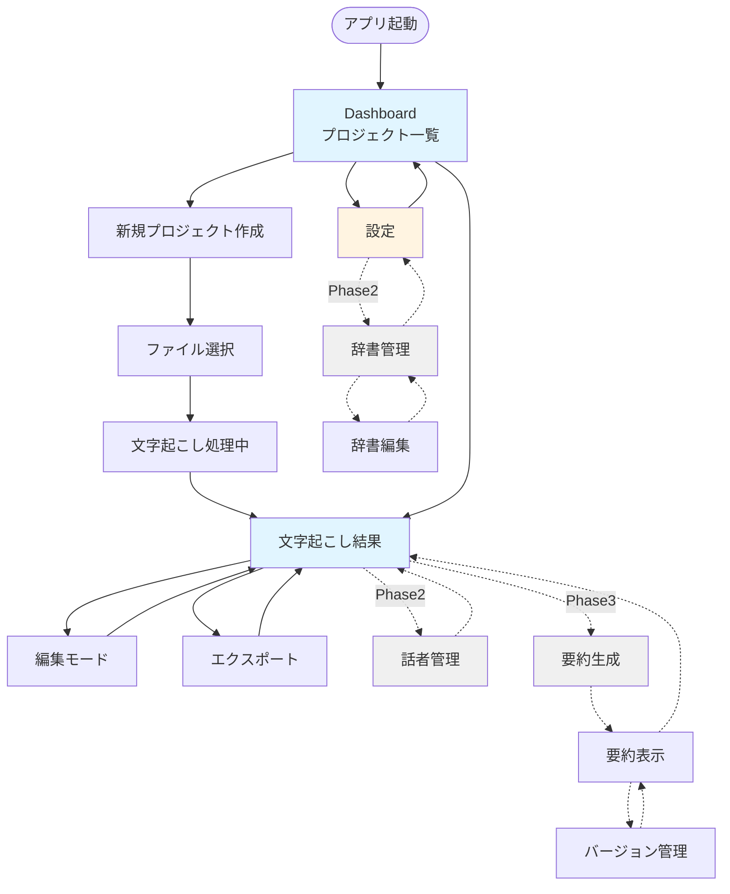

# 画面設計書

## 概要

Transcription Appの全画面設計とユーザーフローを定義します。

---

## 画面遷移図



---

## Phase 1: MVP画面

### 1. Dashboard（プロジェクト一覧）

**目的**: プロジェクトの一覧表示と管理

#### ワイヤーフレーム

```
┌────────────────────────────────────────────────────────────────┐
│  Transcription App                                  [設定] [?] │
├────────────────────────────────────────────────────────────────┤
│                                                                 │
│  プロジェクト一覧                                               │
│  ┌──────────────────────────────────────────────┐             │
│  │ [+新規プロジェクト]  🔍[検索...] [▼すべて]  │             │
│  └──────────────────────────────────────────────┘             │
│                                                                 │
│  ┌─────────────────────────────────────────────────────────┐  │
│  │ 📄 2026年1月 医療カンファレンス        [処理中] 📊 89% │  │
│  │    audio.mp3 • 1時間30分 • 2026-01-03 14:30            │  │
│  │    [▶再開] [削除]                                       │  │
│  ├─────────────────────────────────────────────────────────┤  │
│  │ 📄 営業会議 2025-12-25                 [完了] ✓        │  │
│  │    meeting.wav • 45分 • 2025-12-25 10:00               │  │
│  │    最終編集: 2025-12-25 11:30                          │  │
│  │    [開く] [エクスポート] [削除]                        │  │
│  ├─────────────────────────────────────────────────────────┤  │
│  │ 📄 技術セミナー録音                    [完了] ✓        │  │
│  │    seminar.mp3 • 2時間15分 • 2025-12-20 13:00          │  │
│  │    [開く] [エクスポート] [削除]                        │  │
│  ├─────────────────────────────────────────────────────────┤  │
│  │ 📄 顧客インタビュー                    [エラー] ⚠      │  │
│  │    interview.m4a • 30分 • 2025-12-15 15:00             │  │
│  │    エラー: API接続失敗                                 │  │
│  │    [再試行] [削除]                                     │  │
│  └─────────────────────────────────────────────────────────┘  │
│                                                                 │
│  ┌────────────────────┐                                        │
│  │  📊 統計情報        │                                        │
│  │  プロジェクト: 12  │                                        │
│  │  総処理時間: 15h   │                                        │
│  │  今月: 4件         │                                        │
│  └────────────────────┘                                        │
└────────────────────────────────────────────────────────────────┘
```

#### UI仕様

**ヘッダー**:
- アプリ名: "Transcription App"
- 設定ボタン: 歯車アイコン
- ヘルプボタン: "?" アイコン

**ツールバー**:
- 新規プロジェクトボタン: 大きく目立つ配置
- 検索ボックス: プロジェクト名・音声ファイル名で検索
- フィルター: すべて / 処理中 / 完了 / エラー

**プロジェクトカード**:
- タイトル: ユーザー編集可能
- ステータスバッジ:
  - 処理中: 青、進捗%表示
  - 完了: 緑、チェックマーク
  - エラー: 赤、警告マーク
- メタ情報: ファイル名、長さ、作成日時
- アクション:
  - 処理中: [再開] [削除]
  - 完了: [開く] [エクスポート] [削除]
  - エラー: [再試行] [削除]

**サイドバー統計**:
- 総プロジェクト数
- 総処理時間
- 今月のプロジェクト数

#### インタラクション

- カードクリック → 詳細画面へ
- カードホバー → 影を強調
- 右クリック → コンテキストメニュー

---

### 2. 新規プロジェクト作成

**目的**: 音声ファイルの選択とプロジェクト作成

#### ワイヤーフレーム

```
┌────────────────────────────────────────────────────────────────┐
│  新規プロジェクト作成                                [×閉じる] │
├────────────────────────────────────────────────────────────────┤
│                                                                 │
│  ステップ 1/2: 音声ファイル選択                                │
│  ━━━━━━━━━━━━━━━━━━━━━━━━━━━━━━━━━━━━━━━━━━━━━━━━━━━━━━━━━━ │
│                                                                 │
│  ┌─────────────────────────────────────────────────────────┐  │
│  │                                                          │  │
│  │              📁 ファイルを選択                          │  │
│  │                                                          │  │
│  │         対応形式: MP3, WAV, M4A                         │  │
│  │         最大サイズ: 制限なし（自動分割処理）            │  │
│  │                                                          │  │
│  └─────────────────────────────────────────────────────────┘  │
│                                                                 │
│  選択されたファイル:                                            │
│  ┌─────────────────────────────────────────────────────────┐  │
│  │ 🎵 meeting_2026_01_03.mp3                               │  │
│  │ サイズ: 45.2 MB                                         │  │
│  │ 長さ: 1時間30分                                          │  │
│  │ 形式: MP3 (48kHz, Stereo)                               │  │
│  │                                                   [×削除] │  │
│  └─────────────────────────────────────────────────────────┘  │
│                                                                 │
│  ステップ 2/2: プロジェクト情報（オプション）                  │
│  ━━━━━━━━━━━━━━━━━━━━━━━━━━━━━━━━━━━━━━━━━━━━━━━━━━━━━━━━━━ │
│                                                                 │
│  プロジェクト名:                                                │
│  ┌─────────────────────────────────────────────────────────┐  │
│  │ 2026年1月 営業会議                                      │  │
│  └─────────────────────────────────────────────────────────┘  │
│                                                                 │
│  説明（任意）:                                                  │
│  ┌─────────────────────────────────────────────────────────┐  │
│  │ 2026年度第1四半期の営業戦略会議                         │  │
│  │                                                          │  │
│  └─────────────────────────────────────────────────────────┘  │
│                                                                 │
│  使用する辞書セット（Phase 2）:                                │
│  ┌─────────────────────────────────────────────────────────┐  │
│  │ ☐ ビジネス用語辞書                                      │  │
│  │ ☐ 企業名・製品名辞書                                    │  │
│  │ ☐ IT用語辞書                                            │  │
│  └─────────────────────────────────────────────────────────┘  │
│                                                                 │
│                              [キャンセル] [文字起こし開始] →  │
└────────────────────────────────────────────────────────────────┘
```

#### UI仕様

**ファイル選択エリア**:
- 大きなドロップゾーン（現時点ではボタンのみ）
- 対応形式の明示
- ファイルサイズ制限の説明

**ファイル情報表示**:
- ファイル名
- サイズ
- 推定長さ（メタデータから取得）
- 形式情報
- 削除ボタン

**プロジェクト情報**:
- プロジェクト名: 自動生成（ファイル名ベース）、編集可能
- 説明: オプショナル
- 辞書セット選択（Phase 2）

**バリデーション**:
- ファイル未選択時: 「文字起こし開始」ボタン無効
- 対応していない形式: エラー表示
- ファイルサイズ警告: 4時間以上の場合、処理時間の目安を表示

---

### 3. 文字起こし処理中

**目的**: 処理進捗の可視化

#### ワイヤーフレーム

```
┌────────────────────────────────────────────────────────────────┐
│  文字起こし処理中...                                            │
├────────────────────────────────────────────────────────────────┤
│                                                                 │
│  📄 2026年1月 営業会議                                          │
│  meeting_2026_01_03.mp3 • 1時間30分                            │
│                                                                 │
│  ┌─────────────────────────────────────────────────────────┐  │
│  │                                                          │  │
│  │  処理中: 音声ファイルを分割しています...                │  │
│  │  ━━━━━━━━━━━━━━━━━━━━━━━━━━━━━━━━━ 25%               │  │
│  │                                                          │  │
│  │  ⏱ 推定残り時間: 約5分                                  │  │
│  │  📊 処理済み: 22分30秒 / 1時間30分                      │  │
│  │                                                          │  │
│  └─────────────────────────────────────────────────────────┘  │
│                                                                 │
│  処理ログ:                                                      │
│  ┌─────────────────────────────────────────────────────────┐  │
│  │ ✓ 14:30:15 ファイル検証完了                             │  │
│  │ ✓ 14:30:18 音声を3つのチャンクに分割                    │  │
│  │ ⏳ 14:30:20 Whisper APIに送信中... (1/3)                │  │
│  │                                                          │  │
│  └─────────────────────────────────────────────────────────┘  │
│                                                                 │
│                                            [バックグラウンド化] │
│                                            [キャンセル]         │
└────────────────────────────────────────────────────────────────┘
```

#### UI仕様

**進捗バー**:
- 現在の処理ステップ表示
- パーセンテージ表示
- アニメーション付き

**ステータス情報**:
- 推定残り時間
- 処理済み時間
- 現在の処理ステップ

**処理ログ**:
- タイムスタンプ付き
- アイコンでステータス表示（✓完了、⏳処理中、⚠警告）
- スクロール可能

**アクション**:
- バックグラウンド化: Dashboardに戻り、バックグラウンドで処理継続
- キャンセル: 処理を中断（確認ダイアログ表示）

---

### 4. 文字起こし結果表示・編集

**目的**: 文字起こし結果の閲覧と編集

#### ワイヤーフレーム

```
┌────────────────────────────────────────────────────────────────┐
│ ← [戻る]  2026年1月 営業会議                   [保存] [エクスポート] │
├────────────────────────────────────────────────────────────────┤
│                                                                 │
│ ┌─────────────┬───────────────────────────────────────────┐   │
│ │ 📊 情報      │ 📝 文字起こし  🎙️話者(Phase2)  📋要約(Phase3)│   │
│ ├─────────────┴───────────────────────────────────────────┤   │
│ │ ファイル情報                                             │   │
│ │ 音声ファイル: meeting.mp3                               │   │
│ │ 長さ: 1時間30分                                          │   │
│ │ 作成日: 2026-01-03 14:30                                │   │
│ │ 言語: 日本語                                             │   │
│ │                                                          │   │
│ │ 処理情報                                                 │   │
│ │ モデル: whisper-1                                        │   │
│ │ 平均信頼度: 94%                                          │   │
│ │ セグメント数: 234                                        │   │
│ └──────────────────────────────────────────────────────────┘   │
│                                                                 │
│ ━━━━━━━━━━━━━━━━━━━━━━━━━━━━━━━━━━━━━━━━━━━━━━━━━━━━━━━━━━━ │
│                                                                 │
│ ┌──────────────────────────────────────────────────────────┐   │
│ │ 📝 文字起こし                          [🔍検索] [✏️編集モード] │   │
│ ├──────────────────────────────────────────────────────────┤   │
│ │                                                           │   │
│ │ [00:00:00] 皆さん、おはようございます。本日の営業会議を  │   │
│ │            始めたいと思います。                           │   │
│ │            信頼度: 98%                                    │   │
│ │                                                           │   │
│ │ [00:00:15] まず、第1四半期の売上目標について説明します。 │   │
│ │            前期と比較して15%増の目標を設定しました。      │   │
│ │            信頼度: 95%                                    │   │
│ │                                                           │   │
│ │ [00:00:45] 新製品のローンチスケジュールですが、2月中旬を │   │
│ │            予定しています。マーケティング部門と連携して   │   │
│ │            準備を進めてください。                         │   │
│ │            信頼度: 92%                                    │   │
│ │                                                           │   │
│ │ [00:01:20] 質問があればお願いします。                     │   │
│ │            信頼度: 99%                                    │   │
│ │                                                           │   │
│ │                                                           │   │
│ └──────────────────────────────────────────────────────────┘   │
│                                                                 │
└────────────────────────────────────────────────────────────────┘
```

#### 編集モード

```
┌──────────────────────────────────────────────────────────┐
│ [00:00:15] ┌────────────────────────────────────────┐   │
│            │ まず、第1四半期の売上目標について説明   │   │
│            │ します。前期と比較して15%増の目標を    │   │
│            │ 設定しました。                          │   │
│            │                                  [保存]  │   │
│            └────────────────────────────────────────┘   │
│            信頼度: 95%  [タイムスタンプ調整]            │
└──────────────────────────────────────────────────────────┘
```

#### UI仕様

**ヘッダー**:
- 戻るボタン
- プロジェクト名（編集可能）
- 保存ボタン
- エクスポートボタン

**タブナビゲーション**:
- 情報タブ
- 文字起こしタブ
- 話者タブ（Phase 2）
- 要約タブ（Phase 3）

**情報パネル**:
- ファイル情報
- 処理情報
- 統計情報

**文字起こし表示**:
- タイムスタンプ付きセグメント
- 信頼度表示（色分け: 高=緑、中=黄、低=赤）
- 検索機能
- 編集モード切り替え

**編集機能**:
- インライン編集
- タイムスタンプ調整
- セグメント分割・結合
- 自動保存

**インタラクション**:
- タイムスタンプクリック → 音声再生（Phase 3）
- セグメントホバー → 編集アイコン表示
- Ctrl+F → 検索ボックス表示

---

### 5. エクスポートダイアログ

**目的**: 文字起こし結果のエクスポート

#### ワイヤーフレーム

```
┌────────────────────────────────────────────────────────────────┐
│  エクスポート                                        [×閉じる] │
├────────────────────────────────────────────────────────────────┤
│                                                                 │
│  形式を選択:                                                    │
│  ┌─────────────────────────────────────────────────────────┐  │
│  │ ● JSON形式                                               │  │
│  │   メタデータ、タイムスタンプ、信頼度を含む完全なデータ    │  │
│  │   再インポート可能                                        │  │
│  │                                                          │  │
│  │ ○ Markdown形式                                           │  │
│  │   読みやすい議事録形式                                   │  │
│  │   タイムスタンプ付き                                     │  │
│  │                                                          │  │
│  │ ○ テキスト形式（Phase 1では未対応）                     │  │
│  │   プレーンテキストのみ                                   │  │
│  └─────────────────────────────────────────────────────────┘  │
│                                                                 │
│  オプション:                                                    │
│  ┌─────────────────────────────────────────────────────────┐  │
│  │ ☑ タイムスタンプを含める                                 │  │
│  │ ☑ 信頼度スコアを含める                                   │  │
│  │ ☐ 話者情報を含める（Phase 2）                            │  │
│  │ ☐ セグメントごとに改行                                   │  │
│  └─────────────────────────────────────────────────────────┘  │
│                                                                 │
│  プレビュー:                                                    │
│  ┌─────────────────────────────────────────────────────────┐  │
│  │ {                                                        │  │
│  │   "projectId": "uuid-xxxx",                              │  │
│  │   "title": "2026年1月 営業会議",                         │  │
│  │   "audioFile": "meeting.mp3",                            │  │
│  │   "duration": 5400,                                      │  │
│  │   "transcription": {                                     │  │
│  │     "segments": [                                        │  │
│  │       {                                                  │  │
│  │         "startTime": 0.0,                                │  │
│  │         "endTime": 5.2,                                  │  │
│  │         "text": "皆さん、おはようございます...",        │  │
│  │         "confidence": 0.98                               │  │
│  │       }                                                  │  │
│  │     ]                                                    │  │
│  │   }                                                      │  │
│  │ }                                                        │  │
│  └─────────────────────────────────────────────────────────┘  │
│                                                                 │
│                                      [キャンセル] [エクスポート] │
└────────────────────────────────────────────────────────────────┘
```

#### UI仕様

**形式選択**:
- ラジオボタン
- 各形式の説明
- 用途の提案

**オプション**:
- チェックボックス
- 形式に応じて有効/無効

**プレビュー**:
- 選択した形式でのサンプル表示
- スクロール可能

**エクスポート実行**:
- ファイル保存ダイアログ表示
- デフォルトファイル名: `{プロジェクト名}_{日付}.{拡張子}`

---

### 6. 設定画面

**目的**: アプリケーション設定の管理

#### ワイヤーフレーム

```
┌────────────────────────────────────────────────────────────────┐
│ ← [戻る]  設定                                                  │
├────────────────────────────────────────────────────────────────┤
│                                                                 │
│ ┌──────────┬─────────────────────────────────────────────────┐ │
│ │ 一般     │ 🔧 一般設定                                     │ │
│ │ API      │                                                 │ │
│ │ 言語     │ アプリ名:                                       │ │
│ │ エクスポート│ ┌───────────────────────────────────────┐     │ │
│ │ 詳細     │ │ Transcription App                    │     │ │
│ └──────────┤ └───────────────────────────────────────┘     │ │
│            │                                                 │ │
│            │ デフォルトプロジェクト名フォーマット:           │ │
│            │ ┌───────────────────────────────────────┐     │ │
│            │ │ {年}-{月}-{日} {ファイル名}          │     │ │
│            │ └───────────────────────────────────────┘     │ │
│            │                                                 │ │
│            │ ☑ 自動保存を有効化（5分ごと）                  │ │
│            │ ☑ 起動時に最後のプロジェクトを開く             │ │
│            │                                                 │ │
│            ├─────────────────────────────────────────────────┤ │
│            │ 🔑 API設定                                      │ │
│            │                                                 │ │
│            │ OpenAI API Key:                                 │ │
│            │ ┌───────────────────────────────────────┐     │ │
│            │ │ sk-******************************* [表示] │     │ │
│            │ └───────────────────────────────────────┘     │ │
│            │                                                 │ │
│            │ Whisper モデル:                                 │ │
│            │ ┌───────────────────────────────────────┐     │ │
│            │ │ whisper-1                       ▼    │     │ │
│            │ └───────────────────────────────────────┘     │ │
│            │                                                 │ │
│            │ Claude API Key（Phase 3）:                      │ │
│            │ ┌───────────────────────────────────────┐     │ │
│            │ │ sk-******************************* [表示] │     │ │
│            │ └───────────────────────────────────────┘     │ │
│            │                                                 │ │
│            │ [接続テスト]                                    │ │
│            │                                                 │ │
│            └─────────────────────────────────────────────────┘ │
│                                                                 │
│                                            [リセット] [保存] │
└────────────────────────────────────────────────────────────────┘
```

#### UI仕様

**サイドバーナビゲーション**:
- 一般
- API
- 言語
- エクスポート
- 詳細

**API設定**:
- APIキー入力（マスク表示）
- 表示ボタンで一時的に表示
- 接続テストボタン
- モデル選択

**保存**:
- 変更検知
- 保存確認
- 設定のバリデーション

---

## Phase 2: 拡張機能画面

### 7. 話者管理（Phase 2）

**目的**: 話者の識別と編集

#### ワイヤーフレーム

```
┌────────────────────────────────────────────────────────────────┐
│ 🎙️ 話者管理                                                    │
├────────────────────────────────────────────────────────────────┤
│                                                                 │
│ 識別された話者:                                                 │
│                                                                 │
│ ┌──────────────────────────────────────────────────────────┐   │
│ │ 🔵 Speaker 1                          [名前を編集] [色変更] │   │
│ │    発言数: 45                                              │   │
│ │    総発言時間: 25分30秒                                    │   │
│ │                                                            │   │
│ │    カスタム名:                                             │   │
│ │    ┌────────────────────────────────────────────────┐    │   │
│ │    │ 田中部長                                        │    │   │
│ │    └────────────────────────────────────────────────┘    │   │
│ ├──────────────────────────────────────────────────────────┤   │
│ │ 🟢 Speaker 2                          [名前を編集] [色変更] │   │
│ │    発言数: 38                                              │   │
│ │    総発言時間: 20分15秒                                    │   │
│ │                                                            │   │
│ │    カスタム名:                                             │   │
│ │    ┌────────────────────────────────────────────────┐    │   │
│ │    │ 佐藤課長                                        │    │   │
│ │    └────────────────────────────────────────────────┘    │   │
│ └──────────────────────────────────────────────────────────┘   │
│                                                                 │
│ 文字起こしプレビュー（話者別）:                                 │
│ ┌──────────────────────────────────────────────────────────┐   │
│ │ [00:00:00] 🔵 田中部長:                                   │   │
│ │            皆さん、おはようございます。                   │   │
│ │                                                            │   │
│ │ [00:00:15] 🟢 佐藤課長:                                   │   │
│ │            おはようございます。                           │   │
│ │                                                            │   │
│ │ [00:00:20] 🔵 田中部長:                                   │   │
│ │            それでは、第1四半期の目標について...           │   │
│ └──────────────────────────────────────────────────────────┘   │
│                                                                 │
│                                                    [保存] [閉じる] │
└────────────────────────────────────────────────────────────────┘
```

---

### 8. カスタム辞書管理（Phase 2）

**目的**: 辞書セットと単語の管理

#### ワイヤーフレーム

```
┌────────────────────────────────────────────────────────────────┐
│ 📚 カスタム辞書管理                                             │
├────────────────────────────────────────────────────────────────┤
│                                                                 │
│ ┌──────────────────────────┬──────────────────────────────┐   │
│ │ 辞書セット一覧           │ 辞書エントリ                  │   │
│ ├──────────────────────────┼──────────────────────────────┤   │
│ │ ● 医療用語辞書           │ 🔍 [検索...]  [+追加] [インポート] │   │
│ │   カテゴリ: 医療         │                               │   │
│ │   単語数: 234            │ ┌────────────────────────┐   │   │
│ │   有効 ✓                 │ │ 単語        読み    品詞│   │   │
│ │   [編集] [削除]          │ ├────────────────────────┤   │   │
│ │                          │ │ MRI         エムアー 名詞│   │   │
│ │ ○ IT用語辞書             │ │             ルアイ       │   │   │
│ │   カテゴリ: IT           │ │ 使用回数: 12  [編集] [削除]│   │   │
│ │   単語数: 156            │ ├────────────────────────┤   │   │
│ │   有効 ✓                 │ │ CT          シーティー 名詞│   │   │
│ │   [編集] [削除]          │ │ 使用回数: 8   [編集] [削除]│   │   │
│ │                          │ ├────────────────────────┤   │   │
│ │ ○ 企業名辞書             │ │ カルテ      かるて   名詞│   │   │
│ │   カテゴリ: ビジネス     │ │ 使用回数: 15  [編集] [削除]│   │   │
│ │   単語数: 89             │ └────────────────────────┘   │   │
│ │   有効 ✓                 │                               │   │
│ │   [編集] [削除]          │ [エクスポート CSV]            │   │
│ │                          │                               │   │
│ │ [+新規辞書セット作成]    │                               │   │
│ └──────────────────────────┴──────────────────────────────┘   │
└────────────────────────────────────────────────────────────────┘
```

#### 辞書エントリ追加/編集モーダル

```
┌────────────────────────────────────────────────────────────────┐
│  単語を追加                                          [×閉じる] │
├────────────────────────────────────────────────────────────────┤
│                                                                 │
│  単語:                                                          │
│  ┌─────────────────────────────────────────────────────────┐  │
│  │ MRI                                                      │  │
│  └─────────────────────────────────────────────────────────┘  │
│                                                                 │
│  読み仮名:                                                      │
│  ┌─────────────────────────────────────────────────────────┐  │
│  │ エムアールアイ                                           │  │
│  └─────────────────────────────────────────────────────────┘  │
│                                                                 │
│  品詞:                                                          │
│  ┌─────────────────────────────────────────────────────────┐  │
│  │ 名詞                                                ▼   │  │
│  └─────────────────────────────────────────────────────────┘  │
│                                                                 │
│  説明（任意）:                                                  │
│  ┌─────────────────────────────────────────────────────────┐  │
│  │ 磁気共鳴画像装置                                         │  │
│  └─────────────────────────────────────────────────────────┘  │
│                                                                 │
│                                      [キャンセル] [追加]       │
└────────────────────────────────────────────────────────────────┘
```

---

## Phase 3: AI機能画面

### 9. AI要約生成（Phase 3）

**目的**: 文字起こしからAI要約を生成

#### ワイヤーフレーム

```
┌────────────────────────────────────────────────────────────────┐
│ 📋 AI要約生成                                        [×閉じる] │
├────────────────────────────────────────────────────────────────┤
│                                                                 │
│  要約スタイルを選択:                                            │
│  ┌─────────────────────────────────────────────────────────┐  │
│  │ ☑ 簡易要約（3-5行）                                      │  │
│  │   所要時間: 約10秒 / コスト: $0.05                       │  │
│  │                                                          │  │
│  │ ☑ 詳細要約                                               │  │
│  │   所要時間: 約30秒 / コスト: $0.15                       │  │
│  │                                                          │  │
│  │ ☑ 議事録形式                                             │  │
│  │   所要時間: 約45秒 / コスト: $0.20                       │  │
│  │   - 会議概要、討議内容、決定事項、アクションアイテム     │  │
│  │                                                          │  │
│  │ ☑ アクションアイテム抽出                                 │  │
│  │   所要時間: 約20秒 / コスト: $0.10                       │  │
│  └─────────────────────────────────────────────────────────┘  │
│                                                                 │
│  使用モデル:                                                    │
│  ┌─────────────────────────────────────────────────────────┐  │
│  │ ● Claude 3 Opus（高品質）                                │  │
│  │ ○ Claude 3 Sonnet（バランス型）                          │  │
│  └─────────────────────────────────────────────────────────┘  │
│                                                                 │
│  詳細オプション:                                                │
│  ┌─────────────────────────────────────────────────────────┐  │
│  │ ☐ モデル比較モード（OpusとSonnetの両方で生成）           │  │
│  │ ☐ カスタムプロンプトを使用                               │  │
│  └─────────────────────────────────────────────────────────┘  │
│                                                                 │
│  推定コスト合計: $0.50                                          │
│  推定処理時間: 約1分45秒                                        │
│                                                                 │
│                                      [キャンセル] [生成開始] │
└────────────────────────────────────────────────────────────────┘
```

---

### 10. 要約表示・バージョン管理（Phase 3）

**目的**: 生成された要約の表示と管理

#### ワイヤーフレーム

```
┌────────────────────────────────────────────────────────────────┐
│ 📋 要約                                                         │
├────────────────────────────────────────────────────────────────┤
│                                                                 │
│ ┌──────────────────┬──────────────────────────────────────┐   │
│ │ 要約タイプ       │ 内容                                  │   │
│ ├──────────────────┼──────────────────────────────────────┤   │
│ │ ● 議事録         │ # 2026年1月 営業会議 議事録          │   │
│ │   v3 (アクティブ)│                                      │   │
│ │   2026-01-03     │ ## 会議概要                          │   │
│ │   14:30          │ - 日時: 2026-01-03 10:00-11:30      │   │
│ │   claude-3-opus  │ - 参加者: 田中部長、佐藤課長、他5名  │   │
│ │                  │ - 議題: 第1四半期営業戦略            │   │
│ │   [履歴] [再生成]│                                      │   │
│ │                  │ ## 討議内容                          │   │
│ │ ○ 簡易要約       │ 1. 売上目標の設定                    │   │
│ │   v1             │    - 前期比15%増の目標               │   │
│ │   2026-01-03     │    - 新規顧客開拓に注力              │   │
│ │   14:05          │                                      │   │
│ │   claude-3-sonnet│ 2. 新製品ローンチ計画                │   │
│ │   [表示]         │    - 2月中旬を予定                   │   │
│ │                  │    - マーケティング部門と連携        │   │
│ │ ○ アクション     │                                      │   │
│ │   アイテム       │ ## 決定事項                          │   │
│ │   v1             │ - 週次進捗会議の実施（毎週月曜）     │   │
│ │   2026-01-03     │ - 営業資料の刷新（佐藤課長担当）     │   │
│ │   14:10          │                                      │   │
│ │   claude-3-opus  │ ## アクションアイテム                │   │
│ │   [表示]         │ - [ ] 新規顧客リストの作成（田中、1/10） │   │
│ │                  │ - [ ] ローンチ資料準備（佐藤、1/31） │   │
│ │ [+新規要約生成]  │                                      │   │
│ └──────────────────┴──────────────────────────────────────┘   │
│                                                                 │
│                               [コピー] [エクスポート] [閉じる] │
└────────────────────────────────────────────────────────────────┘
```

#### バージョン履歴モーダル

```
┌────────────────────────────────────────────────────────────────┐
│  議事録 - バージョン履歴                             [×閉じる] │
├────────────────────────────────────────────────────────────────┤
│                                                                 │
│  ┌─────────────────────────────────────────────────────────┐  │
│  │ ● v3 (アクティブ) - 2026-01-03 14:30                    │  │
│  │   モデル: claude-3-opus                                  │  │
│  │   改善: ユーザーフィードバック反映                       │  │
│  │   [表示] [アクティブ化] [削除]                           │  │
│  ├─────────────────────────────────────────────────────────┤  │
│  │ ○ v2 - 2026-01-03 14:15                                  │  │
│  │   モデル: claude-3-opus                                  │  │
│  │   改善: アクションアイテムを追加                         │  │
│  │   [表示] [アクティブ化] [削除]                           │  │
│  ├─────────────────────────────────────────────────────────┤  │
│  │ ○ v1 - 2026-01-03 14:00                                  │  │
│  │   モデル: claude-3-opus                                  │  │
│  │   初回生成                                               │  │
│  │   [表示] [アクティブ化] [削除]                           │  │
│  └─────────────────────────────────────────────────────────┘  │
│                                                                 │
│                                                      [閉じる]   │
└────────────────────────────────────────────────────────────────┘
```

---

## コンポーネント構成

### 共通コンポーネント

```
src/components/
├── common/
│   ├── Button.tsx              # ボタン
│   ├── Modal.tsx               # モーダルダイアログ
│   ├── LoadingSpinner.tsx      # ローディング表示
│   ├── ProgressBar.tsx         # 進捗バー
│   ├── Toast.tsx               # 通知トースト
│   ├── Tabs.tsx                # タブナビゲーション
│   ├── SearchBox.tsx           # 検索ボックス
│   └── Badge.tsx               # ステータスバッジ
├── layout/
│   ├── Header.tsx              # ヘッダー
│   ├── Sidebar.tsx             # サイドバー
│   └── MainLayout.tsx          # メインレイアウト
└── feedback/
    ├── ErrorBoundary.tsx       # エラーハンドリング
    └── ConfirmDialog.tsx       # 確認ダイアログ
```

### 機能別コンポーネント

```
src/components/
├── ProjectCard/
│   ├── ProjectCard.tsx
│   ├── ProjectCard.module.css
│   └── ProjectCardSkeleton.tsx
├── FileUpload/
│   ├── FileUpload.tsx
│   ├── FileDropZone.tsx
│   └── FileInfo.tsx
├── Transcript/
│   ├── TranscriptEditor.tsx
│   ├── SegmentItem.tsx
│   ├── SegmentList.tsx
│   └── TimeStamp.tsx
├── Processing/
│   ├── ProcessingView.tsx
│   ├── ProcessingLog.tsx
│   └── ProcessingStats.tsx
├── Export/
│   ├── ExportDialog.tsx
│   ├── FormatSelector.tsx
│   └── ExportPreview.tsx
├── Settings/
│   ├── SettingsPanel.tsx
│   ├── APIKeyInput.tsx
│   └── SettingSection.tsx
├── Speaker/              # Phase 2
│   ├── SpeakerList.tsx
│   ├── SpeakerEditor.tsx
│   └── SpeakerColorPicker.tsx
├── Dictionary/           # Phase 2
│   ├── DictionarySetList.tsx
│   ├── DictionaryEntryList.tsx
│   ├── DictionaryEditor.tsx
│   └── DictionaryImport.tsx
└── Summary/              # Phase 3
    ├── SummaryGenerator.tsx
    ├── SummaryView.tsx
    ├── SummaryVersionList.tsx
    └── SummaryComparison.tsx
```

---

## デザインシステム

### カラーパレット

```css
/* Primary Colors */
--color-primary: #2563eb;        /* 青 - メインアクション */
--color-primary-hover: #1d4ed8;
--color-primary-light: #dbeafe;

/* Status Colors */
--color-success: #10b981;        /* 緑 - 完了 */
--color-warning: #f59e0b;        /* 黄 - 警告 */
--color-error: #ef4444;          /* 赤 - エラー */
--color-info: #3b82f6;           /* 青 - 情報 */
--color-processing: #8b5cf6;     /* 紫 - 処理中 */

/* Neutral Colors */
--color-gray-50: #f9fafb;
--color-gray-100: #f3f4f6;
--color-gray-200: #e5e7eb;
--color-gray-300: #d1d5db;
--color-gray-500: #6b7280;
--color-gray-700: #374151;
--color-gray-900: #111827;

/* Text Colors */
--text-primary: var(--color-gray-900);
--text-secondary: var(--color-gray-500);
--text-disabled: var(--color-gray-300);

/* Background Colors */
--bg-primary: #ffffff;
--bg-secondary: var(--color-gray-50);
--bg-hover: var(--color-gray-100);
```

### タイポグラフィ

```css
/* Font Family */
--font-sans: -apple-system, BlinkMacSystemFont, 'Segoe UI', 'Roboto', sans-serif;
--font-mono: 'SF Mono', Monaco, 'Cascadia Code', monospace;

/* Font Sizes */
--text-xs: 0.75rem;      /* 12px */
--text-sm: 0.875rem;     /* 14px */
--text-base: 1rem;       /* 16px */
--text-lg: 1.125rem;     /* 18px */
--text-xl: 1.25rem;      /* 20px */
--text-2xl: 1.5rem;      /* 24px */
--text-3xl: 1.875rem;    /* 30px */

/* Font Weights */
--font-normal: 400;
--font-medium: 500;
--font-semibold: 600;
--font-bold: 700;
```

### スペーシング

```css
/* Spacing Scale */
--space-1: 0.25rem;   /* 4px */
--space-2: 0.5rem;    /* 8px */
--space-3: 0.75rem;   /* 12px */
--space-4: 1rem;      /* 16px */
--space-5: 1.25rem;   /* 20px */
--space-6: 1.5rem;    /* 24px */
--space-8: 2rem;      /* 32px */
--space-10: 2.5rem;   /* 40px */
--space-12: 3rem;     /* 48px */
```

### ボーダー・シャドウ

```css
/* Border Radius */
--radius-sm: 0.25rem;   /* 4px */
--radius-md: 0.375rem;  /* 6px */
--radius-lg: 0.5rem;    /* 8px */
--radius-xl: 0.75rem;   /* 12px */
--radius-full: 9999px;

/* Shadows */
--shadow-sm: 0 1px 2px 0 rgb(0 0 0 / 0.05);
--shadow-md: 0 4px 6px -1px rgb(0 0 0 / 0.1);
--shadow-lg: 0 10px 15px -3px rgb(0 0 0 / 0.1);
--shadow-xl: 0 20px 25px -5px rgb(0 0 0 / 0.1);
```

---

## レスポンシブデザイン

### ブレークポイント

```css
/* Breakpoints */
--breakpoint-sm: 640px;   /* タブレット小 */
--breakpoint-md: 768px;   /* タブレット */
--breakpoint-lg: 1024px;  /* ラップトップ */
--breakpoint-xl: 1280px;  /* デスクトップ */
--breakpoint-2xl: 1536px; /* 大画面 */
```

### レイアウト戦略

**Desktop (1024px+)**:
- サイドバーナビゲーション表示
- 3カラムレイアウト可能
- ホバーエフェクト有効

**Tablet (768px - 1023px)**:
- サイドバーを折りたたみ可能
- 2カラムレイアウト
- タッチ対応

**Mobile (< 768px)**:
- Phase 1では対応なし（Electronデスクトップのみ）
- Phase 4でReact Native対応時に専用UI実装

---

## アクセシビリティ

### キーボードナビゲーション

- Tab: フォーカス移動
- Enter: アクション実行
- Esc: モーダル閉じる
- Ctrl/Cmd + S: 保存
- Ctrl/Cmd + F: 検索
- Ctrl/Cmd + E: エクスポート

### ARIA属性

- role属性の適切な使用
- aria-label でスクリーンリーダー対応
- フォーカス管理

### コントラスト比

- WCAG 2.1 AA準拠
- テキストと背景のコントラスト比 4.5:1以上

---

**最終更新**: 2026-01-03
**バージョン**: 1.0
